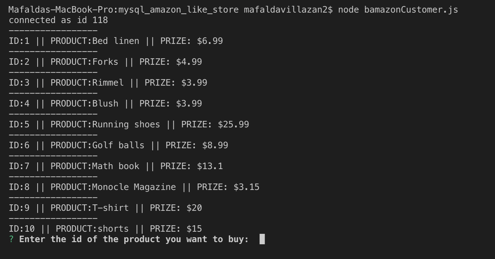
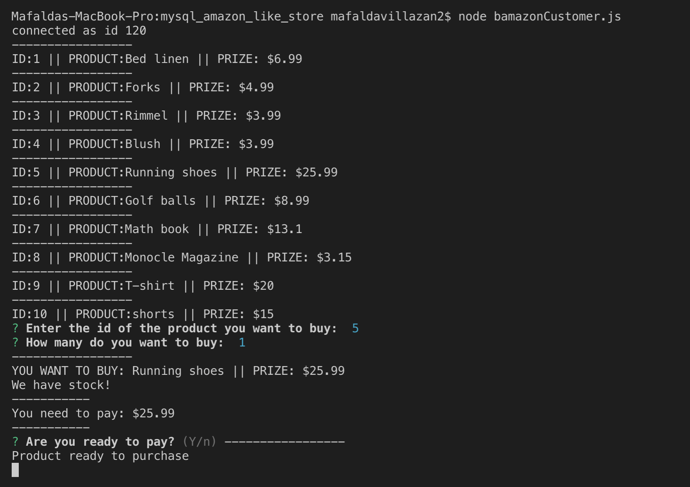
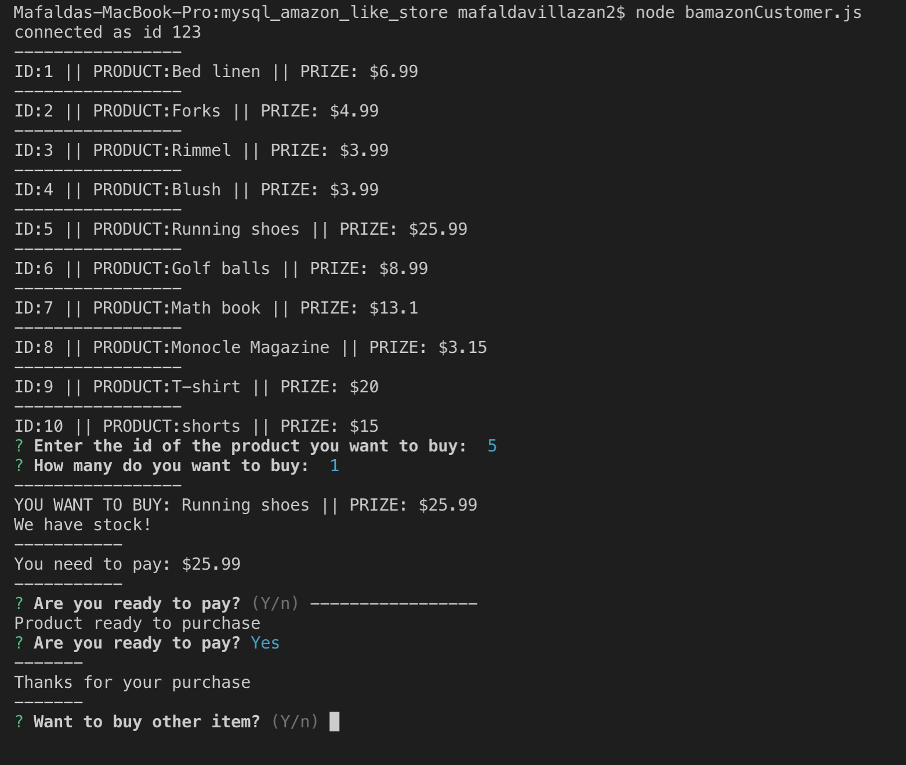
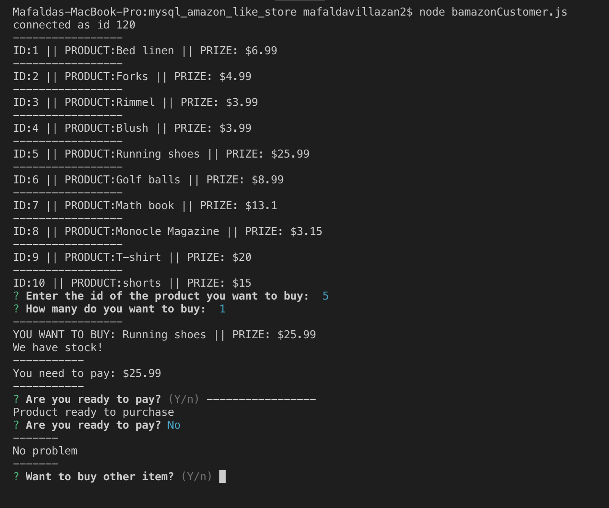
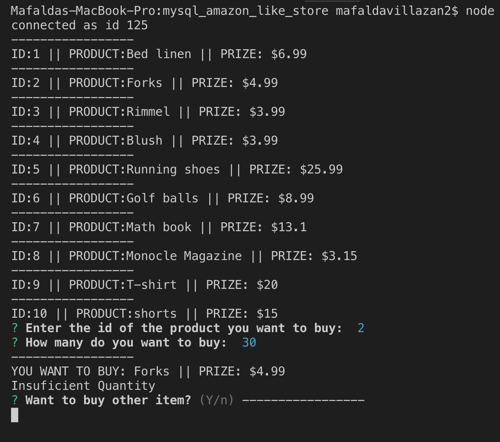
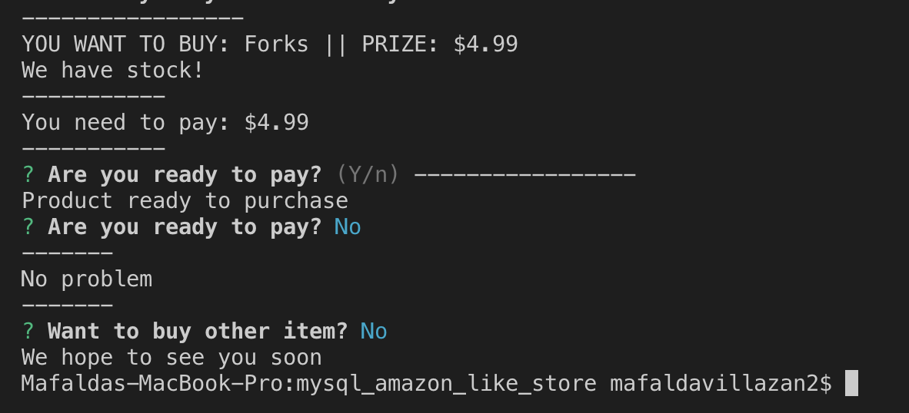

# mysql_amazon_like_store

### Challenge #1: Customer View 

*  When the user gets inside the store

* If the user wants to buy an item and

    * If we have stock
    

        * and the user buys it
        

        * and the user decides he doesn't want to buy it
        

    * If we don't have stock
    

    * If the user doesn't want to buy
    

